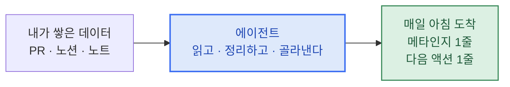

<Hero
  title="나의 학습 에이전트"
  subtitle="나를 점점 더 똑똑하게 만들어주는 학습 에이전트를 직접 만드는 4주"
  description="매일 아침, 내가 만든 에이전트가 내 학습을 1줄로 정리해 보냅니다."
/>

<Callout type="tip">
5회차 발표는 앱·에이전트 기능 소개가 아니라 **자신이 만든 에이전트를 통해 자신이 어떤 변화를 경험했는가**입니다. '나' 데모데이.
</Callout>

## 이렇게 작동합니다

내가 쌓은 데이터를 매일 아침 1줄로 정리해서 본인에게 돌려보냅니다.

매주 라이브에서 한 조각씩 늘립니다. 1회차 프롬프트 → 2회차 저장소 → 3회차 추론 → 4회차 자율 행동. 4주 뒤 결과물은 슬라이드가 아니라 **쓸수록 나에게 맞춰 성장하는 에이전트 한 대**입니다.

##  이번 주 라이브

<Card title="2회차 · 5/20 — 이번 주" icon="📚" href="/week2" meta="LLM과 나, 둘 다를 위한 저장소">
매일 아침 나에게 도착하는 학습 에이전트 v1
</Card>

<CardGrid columns={1}>
  <Card title="1회차 · 5/13 — 지난 주" icon="🚦" href="/week1" meta="Prompt Engineering">
    내 손으로 초안 프롬프트 한 개를 꺼낸다 — 나의 에이전트 v1
  </Card>
</CardGrid>

##  예정 회차

<CardGrid columns={2}>
  <Card title="3회차 · 5/27" icon="🧭" disabled meta="Extended Thinking · 오프라인">
    단계적 추론
  </Card>
  <Card title="4회차 · 6/5" icon="🤖" disabled meta="Agentic Systems">
    학습 플래닝 에이전트
  </Card>
</CardGrid>

##  데모데이

<Card title="5회차 · 6/10 · '나' 데모데이" icon="🎬" disabled meta="에이전트 기능 X · 본인 변화 O">
4주 동안 매주 적은 한 단어를 펼쳐, 본인 변화를 본인이 본다
</Card>

##  챌린지 한눈에

<CardGrid columns={3}>
  <Card title="산출물" icon="🛠️" meta="4주 뒤">
    나의 학습 에이전트 v1 + 누적 한 단어
  </Card>
  <Card title="발표 약속" icon="🎤" meta="5회차">
    에이전트 기능 X · 본인 변화 O
  </Card>
  <Card title="운영 원칙" icon="🧭" meta="강의량 ≠ 개입량">
    가르치는 시간은 적게, 만든 것에 매주 끼어든다
  </Card>
</CardGrid>

---

처음 오셨다면 **[챌린지 소개](/about)** 부터 · 참가자라면 **[이번 주 라이브](/week2)** 로.
