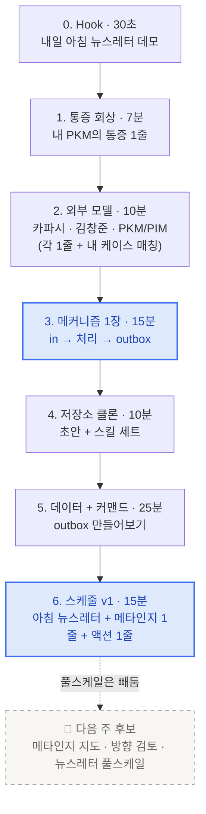

# 2회차 · 5/20 (수) 19:30~21:30

<Callout type="tip">
🎯 **오늘의 목표**: 매일 아침 나에게 도착하는 **학습 에이전트 v1**.
저장소 substrate + 메타인지 한 줄 + 다음 한 줄 액션 — 손으로 굴려본다.
</Callout>

## 흐름 한눈에

7단계로 진행합니다. **메인 액티비티 2개 구조**(메커니즘 다이어그램 · 데이터+커맨드)에 맞추되, 0번 Hook으로 거꾸로 본질을 먼저 깔고 시작합니다.

## 카드

<CardGrid columns={2}>
  <Card title="라이브 흐름 7단계" icon="🚦" href="/week2/flow" meta="시간순 진행안">
    Hook부터 스케줄 v1까지 단계별 상세
  </Card>
  <Card title="outbox 메커니즘" icon="📤" href="/week2/substrate" meta="3번 보강 자료">
    in → 처리 → outbox · 매일 도착하는 뉴스레터의 척추
  </Card>
  <Card title="미션 · 5/26 마감" icon="🎯" href="/week2/mission" meta="개인 + 팀">
    내 outbox 7일 굴리고 1줄 메타인지 5개 모으기
  </Card>
  <Card title="3개 옵션 표 결과" icon="🗳️" meta="4 · 2 · 4 → 1+3 통합">
    1번 앵커 + 3번 substrate · 2번은 다음 한 줄로 흘림
  </Card>
</CardGrid>

## 본질 한 줄

> **오늘 나는 뭘 모르고 있나?**
> 이 질문에 매일 아침 1줄로 답을 받는 v1을 만든다.

산출물·환경·일일 사이클·거꾸로 본질 4축:

| 축 | 내용 |
|---|---|
| 산출물 | 메타인지 한 줄 + 근거 인용 |
| 환경 | 본인 데이터 1소스만 (PR 5개 or 노션 3페이지 or 노트 1폴더) |
| 일일 사이클 | 매일 아침, "오늘 본 데이터 → 1줄 메타인지 → 다음 1줄 행동" |
| 거꾸로 본질 | 라이브 끝나고 본인이 한 번 "어, 내가 OO를 모르고 있었네" 손에 짚으면 성공 |
