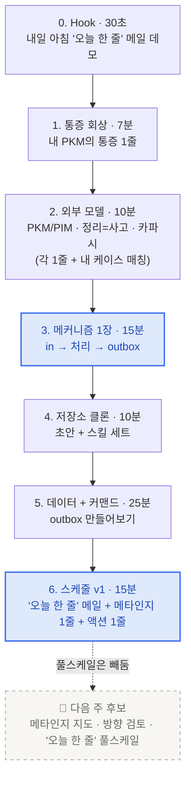

# 2회차 · 5/20 (수) 19:30〜21:30

<Callout type="tip">
🎯 **오늘의 목표**: 매일 아침 나에게 도착하는 **학습 에이전트 v1**.
저장소 substrate + 메타인지 한 줄 + 다음 한 줄 액션 — 손으로 굴려본다.
</Callout>

## 흐름 한눈에

7단계로 진행합니다. **메인 액티비티 2개 구조**(메커니즘 다이어그램 · 데이터+커맨드)에 맞추되, 0번 Hook으로 거꾸로 본질을 먼저 깔고 시작합니다.

## 학습 단원 5개

<CardGrid columns={2}>
  <Card title="1. 지식을 잘 정리한다는건 뭘까?" icon="🪶" href="/week2/knowledge" meta="20분 · Hook + 통증 + 외부 모델">
    내 PKM의 통증 1줄 → PKM/PIM·정리=사고·카파시 짚고 본인 케이스 매칭
  </Card>
  <Card title="2. 나·LLM·저장소 삼자간의 협업 관계" icon="📐" href="/week2/mechanism" meta="15분 · 메인 액티비티 ①">
    내가 쓴 글이 학습을 만들고, 시간순 평문이 LLM이 읽는 토대가 된다
  </Card>
  <Card title="3. 저장소 셋팅" icon="🗂️" href="/week2/setup" meta="10분 · 셋업">
    초안 저장소 clone + .claude/commands/ 자동 로드
  </Card>
  <Card title="4. outbox 설계 + 데이터 + 커맨드" icon="📤" href="/week2/outbox" meta="25분 · 메인 액티비티 ②">
    본인 데이터를 .inbox/에 넣고 /돌아보기 돌려서 outbox/ 만들기
  </Card>
</CardGrid>

<Card title="5. 오늘 한 줄" icon="📨" href="/week2/newsletter" meta="15분 · 매일 아침 도착하는 v1">
`/schedule`로 매일 아침 outbox·.ai-wiki를 읽고 숫자 3개 + 오늘 쓸 한 줄을 본인에게 보냄. 안 봐도 그만인 뉴스레터가 아니라 약속.
</Card>

<CardGrid columns={2}>
  <Card title="미션 · 5/26 마감" icon="🎯" href="/week2/mission" meta="개인 + 팀">
    내 outbox 7일 굴리고 메타인지 1줄 5개 모으기
  </Card>
  <Card title="3개 옵션 표 결과" icon="🗳️" disabled meta="4 · 2 · 4 → 1+3 통합">
    1번 앵커 + 3번 substrate · 2번은 다음 한 줄로 흘림
  </Card>
</CardGrid>

## 본질 한 줄

> **오늘 나는 뭘 모르고 있나?**
> 이 질문에 매일 아침 1줄로 답을 받는 v1을 만든다.

산출물·환경·일일 사이클·거꾸로 본질 4축:

| 축 | 내용 |
|---|---|
| 산출물 | 메타인지 한 줄 + 근거 인용 |
| 환경 | 본인 데이터 1소스만 (PR 5개 or 노션 3페이지 or 노트 1폴더) |
| 일일 사이클 | 매일 아침, "오늘 본 데이터 → 1줄 메타인지 → 다음 1줄 행동" |
| 거꾸로 본질 | 라이브 끝나고 본인이 한 번 "어, 내가 OO를 모르고 있었네" 손에 짚으면 성공 |
