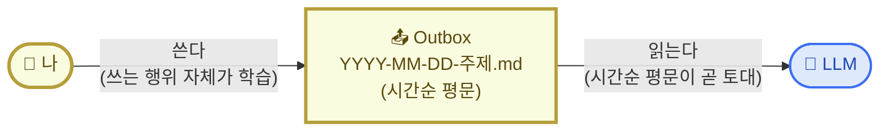
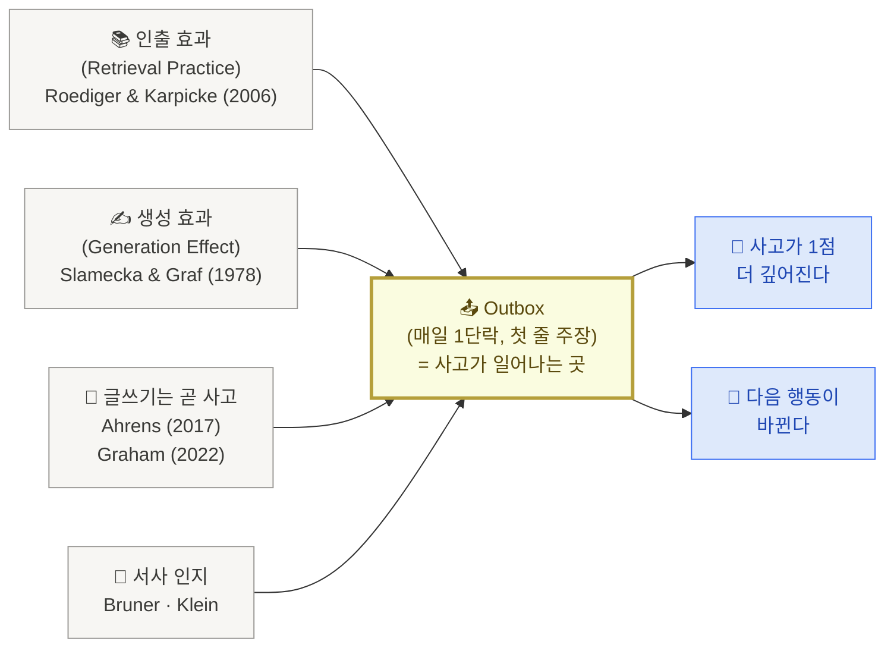
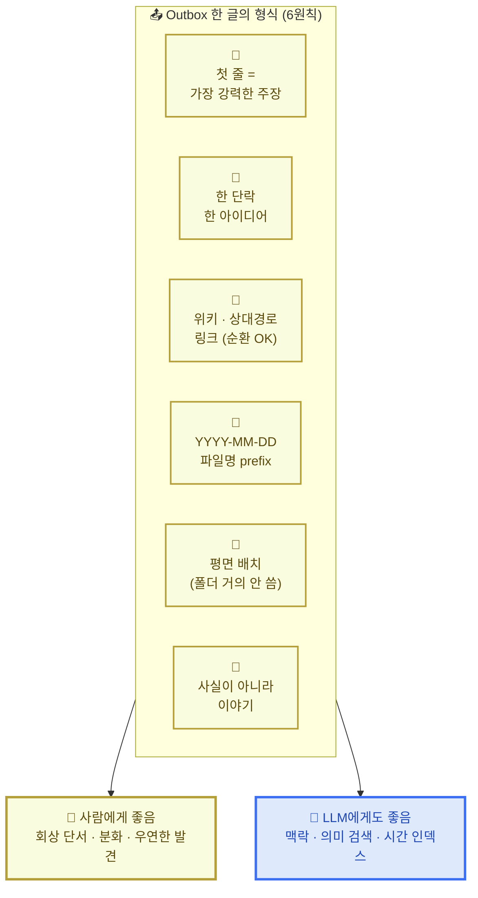

# 2. 나·LLM·저장소 삼자간의 협업 관계

> 지난 페이지에서 우리는 지식을 단순히 모으는 것(PIM)과, 모은 자료가 내 사고로 이어지게 만드는 것(PKM)이 어떻게 다른지를 짚었습니다.

이번 페이지가 풀고 싶은 질문은 하나입니다.

**나·LLM·지식 저장소 셋이 협업이 잘 되려면, 무엇이 중요할까?**

답을 미리 한 줄로 적어두면 이렇습니다 — **내가 직접 쓴 글(Outbox)이 학습을 만들고, 그 글이 시간순 평문으로 쌓이면 LLM이 읽기 좋은 토대가 된다. 한 형식의 글이 사람과 LLM 양쪽을 동시에 만족시킨다.** 오늘의 한 줄 목표가 "내 Outbox에 글 1개 쌓는다"인 이유도 여기 있습니다.

아래 세 단계로 풀어 봅니다.

## 1) 핵심 메커니즘 — 같은 Outbox에서 만난다

세 주체가 협업한다고 했지만, 그 협업의 골격은 의외로 단순합니다.

- **나의 PKM**: 내가 직접 글을 쓴다. 쓰는 동안 생각이 정리되고, 다시 읽으면서 학습이 일어난다.
- **LLM이 읽는 지식 wiki**: 시간순으로 쌓이는 평문 마크다운 파일. 폴더 트리나 분류 체계가 아니라 `2026-05-20-주제.md` 같은 시간 prefix가 곧 색인.

이 둘이 **같은 Outbox 위에서 만나는 것**이 협업의 전부입니다. 폴더 구조나 태그·분류는 본인이 익숙해진 다음에 도입할 부가물이고, 출발은 시간순 평문 한 폴더면 충분합니다.

핵심은 두 가지입니다.

첫째, **내가 쓰는 행위 자체가 학습**입니다. 받아 적는 것이 아니라 내 머리에서 끄집어내서 한 단락을 만들어내는 것. 왜 이게 학습을 만드는지는 다음 섹션에서 학술 근거로 풀어봅니다.

둘째, **시간순 평문이 곧 LLM이 읽기 좋은 토대**입니다. LLM은 깊게 중첩된 폴더 트리를 잘 따라가지 못합니다. `YYYY-MM-DD-주제.md` 형태의 평문 파일이 한 폴더에 시간순으로 쌓이면, LLM이 컨텍스트로 한 번에 끌어와 읽기에 가장 좋은 형태가 됩니다.

<Callout type="info">
**LLM은 Outbox에 직접 쓰지 않습니다.** 다이어그램에서 LLM 쪽에서 Outbox로 가는 화살표가 없는 게 의도된 거예요. LLM이 만들어준 답을 그대로 복사해 붙이면 나는 받아 적은 셈이 되고, 직접 생성한 게 아니므로 학습이 일어나지 않습니다. LLM 응답은 한 줄씩 내가 검토해서 채택할지 정하는 자료일 뿐.
</Callout>

## 2) 왜 Outbox가 중심인가

지금까지 알려진 여러 지식 관리 방법론 — [안드레 카파시](https://karpathy.github.io/)의 LLM wiki, [PARA](https://fortelabs.com/blog/para/), [ACE](https://notes.linkingyourthinking.com/Cards/A.C.E.+Folder+System), [Zettelkasten](https://en.wikipedia.org/wiki/Zettelkasten) — 이름은 다 다르지만, 학습 과학으로 거슬러 올라가면 같은 결론에 모입니다.

> **학습이 일어나는 곳은 "읽기·저장(input)"이 아니라 "쓰기·인출(output)"이다.**

이걸 뒷받침하는 학습 효과가 세 가지 있습니다. 모두 Outbox 쪽에 무게를 실어주는 연구들입니다.

조금 더 풀어보면 — 각 효과가 우리에게 주는 메시지는 이렇습니다.

**첫째, 인출 효과.** Roediger와 Karpicke가 [2006년에 발표한 실험](https://psychnet.wustl.edu/memory/wp-content/uploads/2018/04/Karpicke-Roediger-2008_Sci.pdf)에서, 시험(인출)을 본 학생이 같은 시간 동안 다시 읽기만 한 학생보다 장기 기억이 약 1.5~2배 강했습니다. 즉 Inbox에 자료를 100개 모아두는 것보다, Outbox에 단 한 줄이라도 직접 쓰는 게 학습 효과가 큽니다.

**둘째, 생성 효과.** [Slamecka와 Graf가 1978년에 보고한 효과](https://doi.org/10.1037/0278-7393.4.6.592) — 직접 만들어낸 정보는 받아 적은 정보보다 기억에 더 잘 남습니다. 그래서 LLM이 정리해준 요약을 그대로 복사해 붙이면, 보기에는 깔끔해도 학습은 일어나지 않습니다. LLM의 답은 어디까지나 자료, 내가 한 줄씩 손으로 옮겨 쓰면서 검토해야 학습이 일어납니다.

**셋째, 사실이 아니라 이야기.** 인지심리학자 Bruner와 의사결정 연구자 Klein이 공통적으로 발견한 사실 — 사람의 기억은 명제(사실 진술)보다 서사(이야기) 단위로 더 잘 저장됩니다. "오늘 회의가 있었다"가 아니라 "오늘 회의에서 들은 한 마디가 내 가정을 흔들었다, 왜냐하면…" 같은 식. 결정의 순간, 판단이 바뀐 순간, 불편했던 대화를 한 단락 이야기로 풀어내는 게 핵심.

<Callout type="tip">
Inbox에 매달리면 PIM에 빠집니다. 자료 수집·태그·폴더에 석 달을 쓰는 사이, 정작 내 글은 한 줄도 안 쓰는 패턴. PKM의 본질은 **내가 쓴 한 줄(Outbox)** 에 있고, Inbox는 그 한 줄을 만들기 위한 재료일 뿐. 오늘의 목표가 "내 Outbox에 글 1개 쌓는다"인 이유.
</Callout>

## 3) 한 글의 형식 — 사람에게 좋은 것이 LLM에게도 좋다

여기서 한 가지 더 흥미로운 사실이 있습니다. **같은 Outbox 위에서 두 종류의 인출이 동시에 일어난다는 것.**

하나는 사람의 인출 — 내가 다시 읽으며 떠올리는 그 과정에서 일어나는 학습입니다. 다른 하나는 LLM의 인출 — LLM이 컨텍스트 윈도우에 자료를 끌어와 내 질문에 답하는 과정. 둘이 다르게 보이지만 **잘 작동하려면 같은 글 형식을 요구**합니다.

한 형식이 양쪽을 동시에 만족시킨다는 것 — 이것이 옵션 3 ("LLM과 나, 둘 다를 위한 지식 저장소")의 진짜 약속입니다.

여섯 가지 원칙이 왜 양쪽 모두에게 좋은지, 한 줄씩 정리하면 다음과 같습니다.

| 형식 원칙 | 사람에게 좋은 이유 | LLM에게도 좋은 이유 |
|---|---|---|
| 🧭 첫 줄이 가장 강력한 주장 | 한 문장으로 못 쓰면 그 개념을 모르는 거라는 자기 점검 (Feynman 방식) | 검색 결과 첫 줄이 가장 자주 적중 |
| 📝 한 단락 한 아이디어 | 단일 아이디어 노트 (Zettelkasten의 원칙) | 의미 검색 청크에 친화 |
| 🔗 위키 · 상대경로 링크 (순환 OK) | 노트끼리 연결되면서 통찰이 자연스레 자람 | LLM이 따라갈 수 있는 평문 링크 |
| 📅 `YYYY-MM-DD` 파일명 prefix | 시간순으로 읽히면 그 자체가 서사 | LLM의 시간 인덱스 |
| 📂 평면 배치 (폴더 거의 안 씀) | 같은 단어가 등장한 다른 노트가 자동으로 보이면서 우연한 발견이 일어남 | 폴더 깊이가 깊을수록 LLM에게는 노이즈 |
| 📖 사실이 아니라 이야기 | 서사로 저장되는 기억 | 맥락이 풍부한 청크 |

<Callout type="info">
**내 Outbox가 곧 LLM이 읽는 토대가 됩니다.** 사람용 형식과 LLM용 형식이 따로 있는 게 아니라, 같은 글 한 편이 양쪽을 동시에 만족시켜요. 이게 5표를 받은 옵션 3의 진짜 의미.
</Callout>

## 4) 본인 커스텀 포인트

지금까지의 원칙은 디폴트입니다. 본인 자가진단(1번 페이지)과 막힌 장면에 따라 빈 칸을 직접 채워봅니다.

| 항목 | 디폴트 | 본인 커스텀 |
|---|---|---|
| Outbox 시각 | 매일 아침 7시 | __________ |
| 데이터 소스 | PR · 노션 · 노트 | __________ |
| 1줄 형태 | 메타인지 1줄 + 액션 1줄 | __________ |
| 누적 주기 | 7일 회고 | __________ |
| 폴더 구조 (옵션) | `outbox/` 단일 평면 | ACE? PARA? 다른 식? |

채워 넣을 1줄 예시는 이런 식입니다.

<Callout type="info">
*"나는 Outbox 시각을 **밤 10시(잠들기 전)** 로 바꾼다. 왜냐하면 아침에는 메시지에 묻혀서 다 놓치고, 자기 전에 다음 날 1순위만 보고 싶기 때문이다."*
</Callout>

오늘의 한 줄 목표를 한 번 더 적어두면 — 

<Callout type="tip">
🎯 **"오늘, 내 Outbox에 글 1개 쌓는다."**
6원칙대로 쓴 1단락이면 충분합니다. 그 1글이 내일 아침 `/morning` 의 첫 입력이 됩니다.
</Callout>

→ 다음: [3. 저장소 셋팅](/week2/setup)
