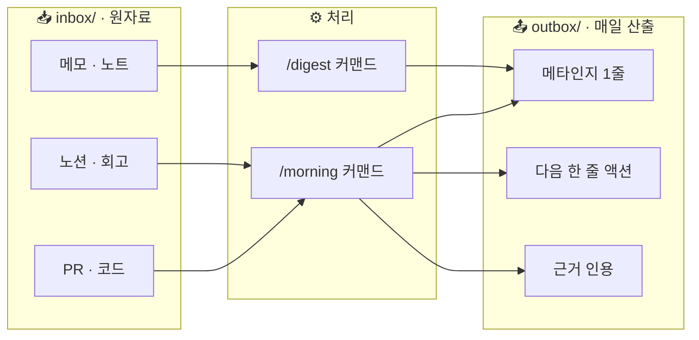

# 2. 핵심 메커니즘 라이브 구성

> 1번 페이지에서 적은 자가진단 5줄을 들고 옵니다. 이걸 가지고 **본인에게 맞는** `in → 처리 → outbox` 메커니즘을 1장 그립니다.

<Callout type="warning">
이 페이지는 **본문 채워야 함** — 라이브 직전에 다이어그램 v0과 커스텀 포인트 표 보강 예정.
</Callout>

## 출발 다이어그램 v0

## 커스텀 포인트 4가지

본인 자가진단 점수와 막힌 장면에 따라, 라이브 15분 동안 같이 손봅니다.

| 항목 | 디폴트 | 본인 커스텀 |
|---|---|---|
| outbox 시각 | 매일 아침 7시 | __________ |
| 데이터 소스 | PR · 노션 · 노트 | __________ |
| 1줄 형태 | 메타인지 1줄 + 액션 1줄 | __________ |
| 누적 주기 | 7일 회고 | __________ |

→ 다음: [3. 저장소 셋팅](/week2/setup)
