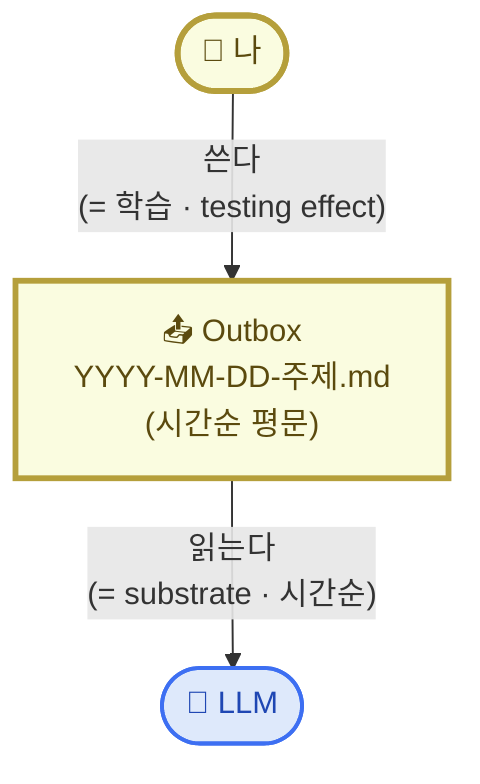
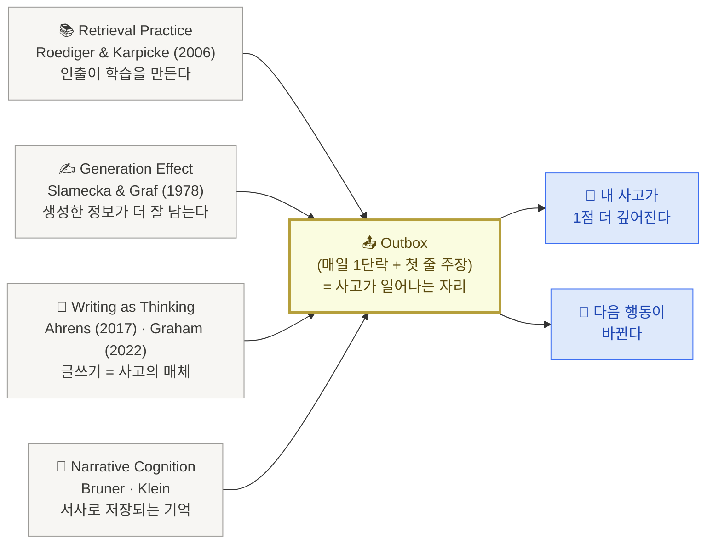
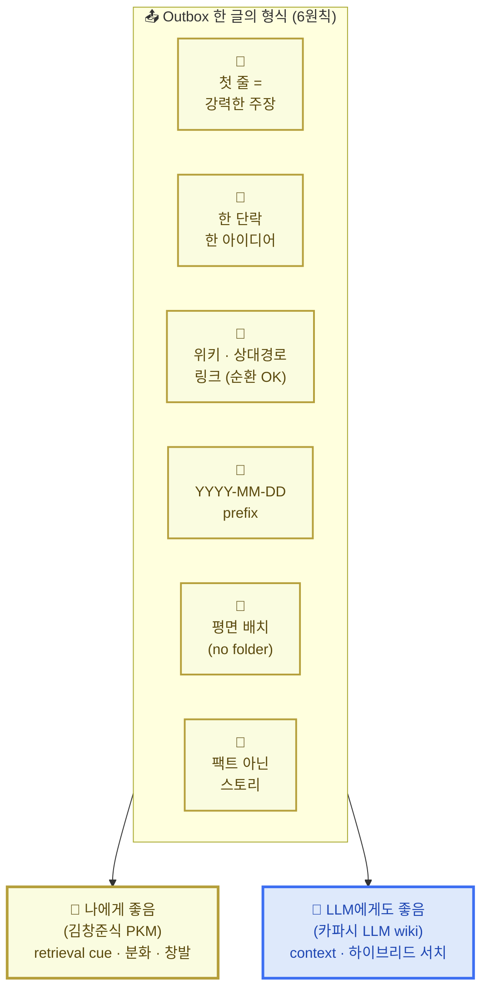

# 2. 나·LLM 저장소 메커니즘 한 장

> 1번 페이지의 **본인 케이스 매칭 1줄**을 들고 옵니다. 나와 LLM이 함께 읽을 저장소가 어떤 모양인지 — `in → 처리 → outbox` 흐름을 한 장으로 그립니다.

이 페이지는 라이브 3번 블록 · **15분**. 메인 액티비티 ①.

옵션 3 ("LLM과 나, 둘 다를 위한 지식 저장소") 5표를 다시 읽어보면 — 단순한 "둘 다"가 아니라 **나·LLM·저장소 3자가 협업하는 관계, 그리고 그 중심이 '나'** 라는 의미입니다. 오늘 라이브의 핵심 목표는 단 하나: **"라이브 끝나고 내 outbox에 글 1개 쌓는다."** 이 페이지는 그 한 글이 왜 중요한지, 그리고 어떤 형식으로 써야 하는지를 짚습니다.

## 1) 3자 협업 — 같은 outbox에서 만난다

핵심 메커니즘은 두 가지뿐입니다.

- **나의 PKM**: 내가 outbox 중심으로 쓴다 → 학습이 일어남 (testing / generation effect)
- **LLM wiki**: 시간순 `.md` 파일 → LLM이 읽기 쉬운 substrate (카파시)

이 둘이 **같은 outbox 위에서 만나는** 것이 옵션 3의 전부. 그 외 폴더 구조·태그·분류는 다 본인 취향의 부가물.



라이브에서 짚을 포인트 2개:

1. **나 → Outbox: 쓰는 행위 자체가 학습** — 받아 적는 게 아니라 직접 생성하는 게 학습. 이게 다음 섹션의 학술 근거.
2. **Outbox → LLM: 시간순 평문이 곧 substrate** — 카파시식 LLM wiki. 폴더 트리·분류 체계가 아니라 `YYYY-MM-DD-주제.md` 가 인덱스.

<Callout type="info">
**LLM은 outbox를 쓰지 않습니다.** 화살표는 LLM에서 outbox로 가지 않아요. LLM 응답은 나를 거쳐 라인 단위로만 채택. 그래야 generation effect가 망가지지 않습니다 (김창준 패치 노트 6.3).
</Callout>

<details>
<summary>🎨 ChatGPT 이미지 프롬프트 — 다이어그램 1</summary>

```text
한국어 인포그래픽 한 장. 사이즈: 가로 비율 4:3.

제목 (상단 굵게): "3자 협업 — 같은 outbox에서 만난다"
부제: "PKM(쓰기=학습) + LLM wiki(시간순=substrate)가 한 outbox 위에서 만나는 가장 간결한 메커니즘"

레이아웃: 세로 3단 (상-중-하).
- 상단: 👤 "나" 원형 노드 — 따뜻한 노란색 배경(#fafce0), 굵은 황금 테두리(#b59f3b).
- 중앙: 📤 "Outbox" 큰 박스 — 따뜻한 노란색(#fafce0), 굵은 황금 테두리.
  박스 안 두 줄:
  · "YYYY-MM-DD-주제.md"
  · "(시간순 평문)"
- 하단: 🤖 "LLM" 원형 노드 — 슬레이트 블루(#dee9fb), 진한 파랑 테두리(#3d6ff2).

화살표 2개 (위→중, 중→하):
- 나 → Outbox: "쓴다 (= 학습 · testing effect)"
- Outbox → LLM: "읽는다 (= substrate · 시간순)"

※ LLM에서 Outbox로 가는 화살표 없음. LLM은 읽기만. 이 점이 시각적으로도 분명히 보이게.

스타일:
- 손그림 느낌이 살짝 섞인 깔끔한 인포그래픽 (참고: "문제 영역과 해결 영역을 나눠서 시각화하라" 톤)
- 한글 sans-serif 폰트
- 배경 흰색, 화살표는 굵고 화살촉 명확
- 화살표 라벨은 화살표 옆에 작은 박스로

하단 메시지 박스 (한 줄, 굵게):
"핵심 메커니즘은 두 화살표뿐이다 — 나는 쓰고, LLM은 읽는다"
```

</details>

## 2) 왜 Outbox가 중심인가 — 학습은 input이 아닌 output에서 일어난다

[안드레 카파시](https://karpathy.github.io/)식 LLM wiki, [PARA](https://fortelabs.com/blog/para/), [ACE](https://notes.linkingyourthinking.com/Cards/A.C.E.+Folder+System), [Zettelkasten](https://en.wikipedia.org/wiki/Zettelkasten) — 방법론 이름은 다 다르지만, 학습과학에서 **단 하나로 수렴**합니다.

> **학습이 일어나는 곳은 input(읽기·저장)이 아니라 output(쓰기·인출)이다.**



라이브에서 짚을 포인트 3개:

1. **Testing Effect (인출 효과)** — [Roediger & Karpicke (2006)](https://psychnet.wustl.edu/memory/wp-content/uploads/2018/04/Karpicke-Roediger-2008_Sci.pdf)의 핵심 발견. 시험(인출)이 단순 재학습보다 장기 기억을 **1.5~2배** 강화. inbox에 100개 저장보다, outbox에 1줄 쓰는 게 학습 효과 큼.
2. **Generation Effect (생성 효과)** — [Slamecka & Graf (1978)](https://doi.org/10.1037/0278-7393.4.6.592). 직접 만든 정보가 받아 적은 정보보다 기억에 더 잘 남음. **LLM이 만들어준 요약을 그대로 붙이면 학습이 안 일어난다** (김창준 패치 노트 6.3과 정확히 일치).
3. **팩트가 아니라 스토리** — Bruner의 narrative cognition. "오늘 회의 있었다"가 아니라 "오늘 회의에서 OO가 한 말이 내 가정을 흔들었다 — 왜냐하면…". 결정의 순간·판단이 바뀐 순간·불편했던 대화를 1단락 서사로.

<Callout type="tip">
**Inbox 중심으로 생각하면 PIM에 빠진다** — 자료 수집·태그·폴더에 3개월. PKM은 **내가 쓴 1줄(outbox)이 본질**, inbox는 그 1줄을 위한 재료일 뿐. 오늘의 목표: "라이브 끝나고 내 outbox에 글 1개 쌓는다."
</Callout>

<details>
<summary>🎨 ChatGPT 이미지 프롬프트 — 다이어그램 2</summary>

```text
한국어 인포그래픽 한 장. 사이즈: 가로 4:3.

제목 (상단 굵게): "왜 Outbox가 중심인가"
부제: "학습은 input(읽기·저장)이 아니라 output(쓰기·인출)에서 일어난다"

레이아웃: 중앙 큰 원 + 좌측 4개 학술 근거 박스 + 우측 2개 결과 박스

좌측 4개 박스 (위에서 아래로), 각 박스 안에 아이콘·효과명·학자·핵심 한 줄:
1. 📚 Retrieval Practice
   Roediger & Karpicke (2006)
   "인출이 학습을 만든다"
2. ✍️ Generation Effect
   Slamecka & Graf (1978)
   "생성한 정보가 더 잘 남는다"
3. 📝 Writing as Thinking
   Ahrens (2017) · Graham (2022)
   "글쓰기 = 사고의 매체"
4. 📖 Narrative Cognition
   Bruner · Klein
   "서사로 저장되는 기억"

→ 4개 박스에서 화살표가 모두 중앙으로 모여듦

중앙: 📤 큰 원/박스, 따뜻한 노란색(#fafce0) 강조, 굵은 황금 테두리(#b59f3b)
  "Outbox"
  "매일 1단락 + 첫 줄 주장"
  "= 사고가 일어나는 자리"

→ 중앙에서 우측으로 화살표 2개:
- 🧠 "내 사고가 1점 더 깊어진다" (슬레이트 블루 톤)
- 🎯 "다음 행동이 바뀐다" (슬레이트 블루 톤)

스타일:
- 학술 포스터 + 인포그래픽의 중간 톤
- 좌측 학술 박스는 회색~베이지 톤(#f7f6f3), 학자 이름은 작게 영문, 효과명은 굵게
- 중앙 Outbox는 가장 시각적으로 무거움
- 우측 결과는 액션 색(슬레이트 블루)
- 흰 배경, 화살촉 명확

하단 메시지 박스 (한 줄, 굵게):
"inbox에 100개 저장보다, outbox에 1줄 쓰는 게 학습 효과 크다"
```

</details>

## 3) Outbox 한 글의 형식 — 나에게 좋은 것이 LLM에게도 좋다

> **같은 outbox 위에서 두 가지 retrieval이 일어난다** — 사람의 인출(testing effect) + LLM의 인출(하이브리드 서치). 한 형식으로 둘 다 만족시키는 게 옵션 3의 진짜 약속입니다. (출처: 김창준 패치 노트 6.4 *"두 가지 의미의 Retriever"*)



6원칙 대응표 — **같은 원칙이 양쪽 다 만족**:

| 형식 원칙 | 나에게 좋은 이유 (김창준식) | LLM에게도 좋은 이유 (카파시식) |
|---|---|---|
| 🧭 첫 줄 = 강력한 주장 | definitional commitment (Feynman) | LLM 컨텍스트 헤더 · 검색 결과 첫 줄 적중 |
| 📝 한 단락 한 아이디어 | atomic note (Luhmann) | RAG 청킹 친화 |
| 🔗 위키·상대경로 링크 | graph 구조, 순환 = 통찰 경로 | LLM이 따라갈 수 있는 평문 링크 |
| 📅 `YYYY-MM-DD` prefix | 시간순 = 서사 (Bruner) | LLM의 시간 인덱스 |
| 📂 평면 배치 | 해피 액시던트 (Unlinked Mentions) | 폴더 깊이 = 노이즈 |
| 📖 팩트 아닌 스토리 | narrative cognition | 맥락이 풍부한 청크 |

<Callout type="info">
**내 outbox가 곧 LLM 컨텍스트의 substrate** — 사람용 형식과 LLM용 형식이 충돌하지 않습니다. 같은 자리에서 만납니다. 이게 옵션 3 5표의 진짜 의미.
</Callout>

<details>
<summary>🎨 ChatGPT 이미지 프롬프트 — 다이어그램 3</summary>

```text
한국어 인포그래픽 한 장. 사이즈: 가로 4:3.

제목 (상단 굵게): "Outbox 한 글의 형식 — 나에게 좋은 것이 LLM에게도 좋다"
부제: "같은 outbox 위에서 두 가지 retrieval이 일어난다 (사람의 인출 + LLM의 인출)"

레이아웃: 좌우 대칭. 중앙에 6원칙 그리드, 좌·우로 사용자 박스.

중앙 (가장 큰 영역, 베이지 박스 #f7f6f3 안에 6칸 그리드 3×2):
"📤 Outbox 한 글의 형식 (6원칙)"
각 칸:
1. 🧭 첫 줄 = 강력한 주장
2. 📝 한 단락 한 아이디어
3. 🔗 위키·상대경로 링크 (순환 OK)
4. 📅 YYYY-MM-DD prefix
5. 📂 평면 배치 (no folder)
6. 📖 팩트 아닌 스토리

좌측 박스 (따뜻한 노란색 #fafce0, 굵은 황금 테두리 #b59f3b):
👤 "나에게 좋음"
부제: "김창준식 PKM"
세부: "retrieval cue · 분화 · 창발"

우측 박스 (슬레이트 블루 #dee9fb, 굵은 파랑 테두리 #3d6ff2):
🤖 "LLM에게도 좋음"
부제: "카파시 LLM wiki"
세부: "context window · 하이브리드 서치 · RAG"

화살표: 중앙 6원칙에서 좌측·우측으로 동시에 굵은 화살표가 나감.
→ "같은 형식이 둘 다 만족"이 시각적으로 즉시 보임.

스타일:
- 좌우 대칭, 가운데 6원칙이 무게중심
- 각 원칙 칸 안에 작은 아이콘 + 굵은 한글 두 줄
- 한글 sans-serif, 깔끔한 인포그래픽
- 배경 흰색

하단 메시지 박스 (한 줄, 굵게):
"내 outbox가 곧 LLM 컨텍스트의 substrate가 된다"
```

</details>

## 4) 본인 커스텀 포인트 — 라이브 15분

본인 자가진단(1번 페이지)과 막힌 장면에 따라, 라이브에서 같이 손봅니다.

| 항목 | 디폴트 | 본인 커스텀 |
|---|---|---|
| outbox 시각 | 매일 아침 7시 | __________ |
| 데이터 소스 | PR · 노션 · 노트 | __________ |
| 1줄 형태 | 메타인지 1줄 + 액션 1줄 | __________ |
| 누적 주기 | 7일 회고 | __________ |
| 폴더 구조 (옵션) | `outbox/` 단일 평면 | ACE? PARA? 다른 식? |

채워 넣을 1줄 예시:

<Callout type="info">
*"나는 outbox 시각을 **22시(잠들기 전)** 로 바꾼다. 왜냐하면 아침엔 메시지 다 놓치고, 자기 전에 다음날 1순위만 보고 싶기 때문이다."*
</Callout>

오늘의 핵심 목표 한 번 더:

<Callout type="tip">
🎯 **"오늘 라이브 끝나고 내 outbox에 글 1개 쌓는다."**
6원칙대로 쓴 1단락이면 충분. 그 1글이 내일 아침 `/morning` 의 첫 입력이 됩니다.
</Callout>

→ 다음: [3. 저장소 셋팅](/week2/setup)
