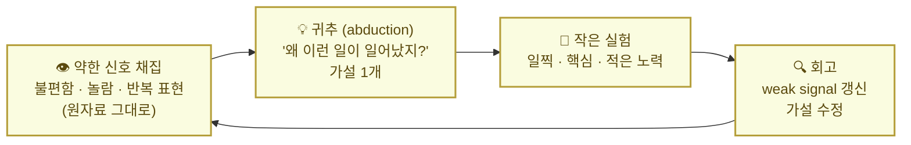
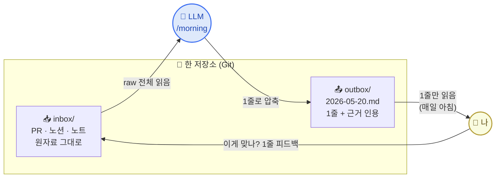

# 2. 나·LLM 저장소 메커니즘 한 장

> 1번 페이지의 **본인 케이스 매칭 1줄**을 들고 옵니다. 나와 LLM이 함께 읽을 저장소가 어떤 모양인지 — `in → 처리 → outbox` 흐름을 한 장으로 그립니다.

이 페이지는 라이브 3번 블록 · **15분**. 메인 액티비티 ①. 앞 페이지가 "왜 PKM인가"를 깔았다면, 이 페이지는 "PKM이 작동하는 메커니즘은 뭔가"로 한 단계 내려갑니다.

## 1) 김창준식 PKM — 저장소가 아니라 사이클

**김창준이 강조하는 PKM의 핵심은 "저장"이 아니라 "사이클"이다.** 약한 신호에서 가설을 만들고, 작은 실험으로 검증하고, 회고하면서 다시 신호를 잡는 흐름. 방법론 이름(Zettelkasten · PARA · LLM wiki)을 외우는 것보다 **무엇이 작동하게 만드는 메커니즘**을 보는 게 더 중요하다는 게 그의 입장입니다.

<Callout type="note">
출처: 김창준 『[함께 자라기](https://www.aladin.co.kr/shop/wproduct.aspx?ItemId=171144250)』(인사이트, 2018), [애자일 이야기](https://agile.egloos.com/) 블로그 정리에서 풀어 씀. 다이어그램은 학습 사이클·약한 신호·귀추(abduction)·작은 실험 framing을 본 페이지 맥락에 맞게 압축한 것입니다.
</Callout>

라이브에서 짚을 포인트 3개:

1. **출발점이 "정보"가 아니라 "weak signal"** — 회의 중 어색했던 1초, 코드리뷰에서 반복된 댓글 패턴, 또 똑같은 실수. 객관 자료가 아니라 본인 안에서 떠오른 작은 신호.
2. **산출물이 "노트"가 아니라 "다음 행동의 변화"** — 평가 기준은 "정리됐는가"가 아니라 **"내가 1점 더 잘하게 됐나"**.
3. **귀추(abduction)가 PKM의 진짜 엔진** — 작은 단서에서 그럴듯한 가설을 만드는 작업. 분류·태그·폴더가 아닙니다.

<Callout type="info">
이 사이클이 한 바퀴 돌면 본인이 작아도 1점 변화합니다. PKM 도구가 깔끔해도 사이클이 안 돌면 변화 없음. **사이클이 본질, 도구는 보조.**
</Callout>

## 2) 우리 시스템 v1 — abduction을 LLM에게 위임한다

> **한 저장소를 사람과 LLM이 정반대 방향으로 읽는다.**

라이브에서 짚을 포인트 3개:

1. **저장소는 1개, 화살표는 2방향** — Git 저장소 1개 안에 `inbox/`와 `outbox/`가 같이 산다. 폴더 트리가 분리하는 게 아니라 **시간순 파일명**(`YYYY-MM-DD-*.md`)이 인덱스.
2. **읽는 양의 비대칭** — LLM은 모든 raw, 사람은 1줄. 사람이 매일 1줄만 읽는다는 게 핵심. 인지 부담이 0에 가까워야 7일·30일을 굴립니다.
3. **사이클이 닫힌다** — 사람의 피드백 1줄("이게 맞나?")이 다음날 LLM 입력. 매일 학습 가중치가 inbox에 쌓입니다.

## 3) 두 다이어그램의 매핑

우리 시스템은 김창준식 사이클의 **귀추 단계를 LLM이 가속**하는 구체 구현입니다. 사람의 일은 **신호 채집(앞)** 과 **실험·회고(뒤)** 에 남습니다.

| 김창준식 사이클 | 우리 시스템 |
|---|---|
| 👁️ 약한 신호 채집 | `inbox/` (PR · 노션 · 노트 raw) |
| 💡 귀추 (가설) | `/morning` 커맨드 (LLM이 abduction 가속) |
| 🎯 작은 실험 | outbox 1줄 + 다음 한 줄 액션 |
| 🔍 회고 → 갱신 | 사람 피드백 1줄을 다시 `inbox/` 로 |

<Callout type="tip">
**왜 LLM에게 귀추를 맡기나** — 사람은 본인 패턴을 자기가 못 봅니다. 코드리뷰 100건에서 반복되는 약점, 회고 30개에서 떨어지는 같은 단어. 본인은 매일 한 건씩 봐서 안 보이는데, LLM은 한 번에 다 봅니다. **사람이 못 보는 패턴을 LLM이 1줄로 박는다** — 이게 abduction 가속의 의미.
</Callout>

## 4) 본인 커스텀 포인트 — 라이브 15분

본인 자가진단(1번 페이지)과 막힌 장면에 따라, 라이브에서 같이 손봅니다.

| 항목 | 디폴트 | 본인 커스텀 |
|---|---|---|
| outbox 시각 | 매일 아침 7시 | __________ |
| 데이터 소스 | PR · 노션 · 노트 | __________ |
| 1줄 형태 | 메타인지 1줄 + 액션 1줄 | __________ |
| 누적 주기 | 7일 회고 | __________ |

채워 넣을 1줄 예시:

<Callout type="info">
*"나는 outbox 시각을 **22시(잠들기 전)** 로 바꾼다. 왜냐하면 아침엔 메시지 다 놓치고, 자기 전에 다음날 1순위만 보고 싶기 때문이다."*
</Callout>

→ 다음: [3. 저장소 셋팅](/week2/setup)
