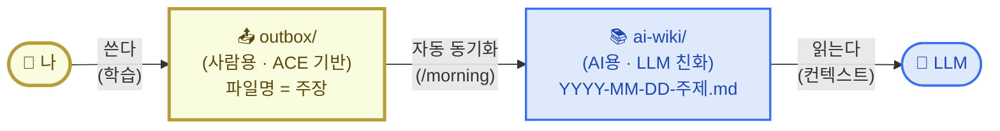
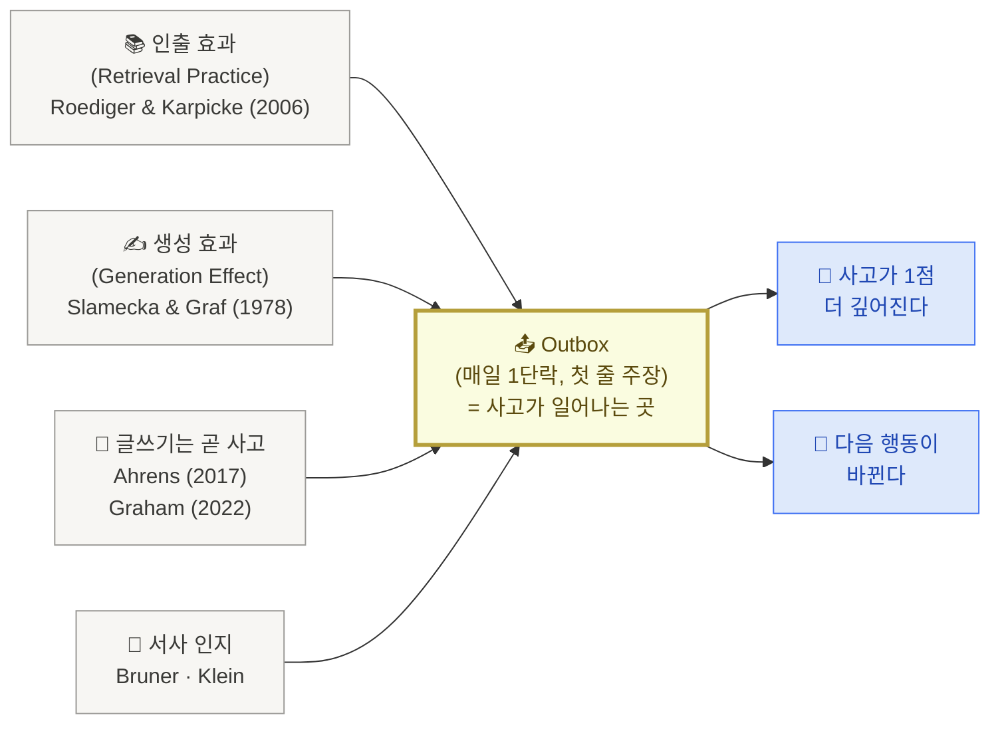
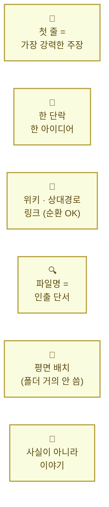

# 2. 나·LLM·저장소 삼자간의 협업 관계

> 지난 페이지에서 우리는 지식을 단순히 모으는 것(PIM)과, 모은 자료가 내 사고로 이어지게 만드는 것(PKM)이 어떻게 다른지를 짚었습니다.

이번 페이지가 풀고 싶은 질문은 하나입니다.

**나·LLM·지식 저장소 셋이 협업이 잘 되려면, 무엇이 중요할까?**

답을 미리 한 줄로 적어두면 이렇습니다 — **사람과 LLM이 좋아하는 형식은 실제로 다르다. 그래서 한 저장소 안에 두 영역을 둔다. 사람은 `outbox/`에만 쓰고, `ai-wiki/`는 자동으로 채워진다.** 오늘의 한 줄 목표가 "내 Outbox에 글 1개 쌓는다"인 이유도 여기 있습니다.

아래 세 단계로 풀어 봅니다.

## 1) 핵심 메커니즘 — 한 저장소에 두 영역

세 주체가 협업한다고 했지만, 그 골격은 의외로 단순합니다. 두 영역으로 자리를 나누면 정리됩니다.

- **사람용 영역 `outbox/`** — 내가 직접 쓰는 자리. ACE 분류(Atlas·Effort·Calendar)와 의미 있는 파일명으로. 사람이 보고 찾고 다시 읽기 좋게.
- **AI용 영역 `ai-wiki/`** — LLM이 읽는 자리. 시간순 평문 `YYYY-MM-DD-주제.md` 파일이 한 폴더에 평면으로. LLM이 컨텍스트로 한꺼번에 끌어와 읽기 좋게.

두 영역 사이는 **자동 동기화**가 책임집니다. 사람은 `outbox/`에만 글을 쓰고, `/morning` 같은 커맨드가 그 글을 `ai-wiki/`로 복사·정리합니다. 사람과 LLM이 좋아하는 형식이 실제로 다르다는 것을 인정하고, 같은 글의 두 가지 view로 나눈 셈입니다.

저장소 자체는 여전히 Git repo 한 개입니다. 그 안에 두 영역이 같이 살 뿐.

핵심은 세 가지입니다.

첫째, **사람은 `outbox/`만 신경쓰면 됩니다.** ACE 분류와 의미 있는 파일명으로 글을 쓰는 자리. 시간순 prefix 같은 운영 정보는 신경 안 써도 됩니다.

둘째, **자동 동기화가 `ai-wiki/`를 채웁니다.** `/morning` 커맨드가 `outbox/`의 글을 읽어 시간 prefix로 `ai-wiki/`에 복제·정리. 사람은 한 번도 `ai-wiki/`를 직접 만지지 않습니다.

셋째, **LLM은 `ai-wiki/`만 읽습니다.** 사람용 `outbox/`에는 직접 접근하지 않습니다. 이게 안전장치 — LLM이 사람 영역을 망가뜨릴 수 없게.

<Callout type="info">
**`ai-wiki/`는 LLM이 읽기만 하는 영역**입니다. 사람의 `outbox/`와 분리된 게 의도된 거예요. LLM이 만들어준 답을 그대로 `outbox/`에 붙이면 나는 받아 적은 셈이라 학습이 일어나지 않습니다. LLM 응답은 한 줄씩 내가 검토해서 채택할지 정하고, 채택한다면 내 손으로 `outbox/`에 옮겨 적는 자료일 뿐.
</Callout>

### outbox 경계 — 단위는 내 손, 다듬기는 AI 손

> **"AI한테 다시 써줘"는 PIM, "내가 약한 부분 짚어줘"는 PKM.**

LLM 응답을 한 줄씩 검토해 채택한다고 했을 때 — 현실적으로 내가 쓴 글을 AI한테 맞춤법 받고 문장 다듬는 경우가 많습니다. 어디까지 AI에 넘겨야 outbox의 학습 효과가 살아남을까. generation effect의 원 논문(Slamecka & Graf 1978)이 본 단위에서 답이 나옵니다. 학습은 *글자*가 아니라 *하나의 의미 청크를 내가 만들었는가*에서 갈립니다.

핵심 원칙 세 가지:

1. **단위(=하나의 아이디어)는 내가 직접** — 1단락 = 1주장 단위는 100% 내 손으로 생성. AI가 단락을 통째로 다시 써주면 generation effect가 무너집니다.
2. **첫 줄 주장은 절대 외주 X** — 6원칙의 "🧭 첫 줄 = 강력한 주장"은 그 자체가 사고의 산물. 다듬기조차 AI에 안 넘깁니다.
3. **다듬기는 AI OK** — 맞춤법·문장 흐름·단어 교체·문법은 인지 부하만 잡아먹지 학습 효과는 안 깎습니다. 여기는 자유롭게.

| 작업 | 누가 | 이유 |
|---|---|---|
| 단락 단위 초안 | **나** | generation effect가 일어나는 단위 |
| 첫 줄 주장 만들기 | **나** | 정의적 commitment (Feynman) |
| 단락 구조 재배치 | **나** | 사고의 흐름 = 내 판단 |
| 맞춤법·문법 | AI | 학습과 무관한 인지 부하 |
| 문장 흐름 다듬기 | AI | 메시지는 내가 정했으니 표현만 |
| 단어 교체·동의어 | AI | 의미는 내가 잡고 어휘만 |

메타 룰 — AI를 부르는 방식:

> **"이거 다시 써줘" X / "내가 약한 부분 짚어줘 · 반박해봐" O.**

AI를 *출력자*가 아니라 *인출자*로 씁니다. AI가 약점을 짚으면 결국 내가 다시 쓰게 되고, 그게 인출(testing effect)을 한 번 더 돌립니다. 같은 outbox 위에서 학습이 두 번 일어나는 셈.

함정: 단락 통째로 AI에 던지고 "더 좋게 다듬어줘"라고 부르는 패턴. 결과물은 깔끔해지지만 *내가 어디서 막혔는지*가 outbox에서 지워집니다. 1주일 뒤 그 글을 다시 봐도 내 사고의 흔적이 안 남고, 카파시 wiki 외형만 갖춘 PIM 상태가 됩니다.

## 2) 왜 Outbox가 중심인가

지금까지 알려진 여러 지식 관리 방법론 — [안드레 카파시](https://karpathy.github.io/)의 LLM wiki, [PARA](https://fortelabs.com/blog/para/), [ACE](https://notes.linkingyourthinking.com/Cards/A.C.E.+Folder+System), [Zettelkasten](https://en.wikipedia.org/wiki/Zettelkasten) — 이름은 다 다르지만, 학습 과학으로 거슬러 올라가면 같은 결론에 모입니다.

> **학습이 일어나는 곳은 "읽기·저장(input)"이 아니라 "쓰기·인출(output)"이다.**

이걸 뒷받침하는 학습 효과가 세 가지 있습니다. 모두 Outbox 쪽에 무게를 실어주는 연구들입니다.

조금 더 풀어보면 — 각 효과가 우리에게 주는 메시지는 이렇습니다.

**첫째, 인출 효과.** [Roediger와 Karpicke가 2006년에 발표한 실험](https://psychnet.wustl.edu/memory/wp-content/uploads/2018/04/Karpicke-Roediger-2008_Sci.pdf)에서, 시험(인출)을 본 학생이 같은 시간 동안 다시 읽기만 한 학생보다 장기 기억이 약 1.5〜2배 강했습니다. 즉 Inbox에 자료를 100개 모아두는 것보다, Outbox에 단 한 줄이라도 직접 쓰는 게 학습 효과가 큽니다.

**둘째, 생성 효과.** [Slamecka와 Graf가 1978년에 보고한 효과](https://doi.org/10.1037/0278-7393.4.6.592) — 직접 만들어낸 정보는 받아 적은 정보보다 기억에 더 잘 남습니다. 그래서 LLM이 정리해준 요약을 그대로 복사해 붙이면, 보기에는 깔끔해도 학습은 일어나지 않습니다. LLM의 답은 어디까지나 자료, 내가 한 줄씩 손으로 옮겨 쓰면서 검토해야 학습이 일어납니다.

**셋째, 글쓰기는 곧 사고다.** 글쓰기를 단순한 기록이 아니라 사고가 일어나는 매체로 보는 관점. Sönke Ahrens는 *[How to Take Smart Notes](https://www.takesmartnotes.com/)*에서 "글쓰기는 연구·학습 뒤에 따라오는 것이 아니라, 그 모든 작업의 매체다"라고 정리했고, Paul Graham은 ["잘 안다고 생각했던 것도 글로 써보면 생각만큼 모르지 않다는 게 드러난다"](http://paulgraham.com/words.html)고 적었습니다.

**넷째, 사실이 아니라 이야기.** 인지심리학자 [Jerome Bruner](https://en.wikipedia.org/wiki/Jerome_Bruner)와 의사결정 연구자 [Gary Klein](https://en.wikipedia.org/wiki/Gary_Klein)이 공통적으로 발견한 사실 — 사람의 기억은 명제(사실 진술)보다 서사(이야기) 단위로 더 잘 저장됩니다. "오늘 회의가 있었다"가 아니라 "오늘 회의에서 들은 한 마디가 내 가정을 흔들었다, 왜냐하면…" 같은 식. 결정의 순간, 판단이 바뀐 순간, 불편했던 대화를 한 단락 이야기로 풀어내는 게 핵심.

<Callout type="tip">
Inbox에 매달리면 PIM에 빠집니다. 자료 수집·태그·폴더에 석 달을 쓰는 사이, 정작 내 글은 한 줄도 안 쓰는 패턴. PKM의 본질은 **내가 쓴 한 줄(Outbox)** 에 있고, Inbox는 그 한 줄을 만들기 위한 재료일 뿐. 오늘의 목표가 "내 Outbox에 글 1개 쌓는다"인 이유.
</Callout>

## 3) `outbox/` 한 글의 형식 — 6원칙

§1에서 두 영역으로 자리를 나눴으니, 이제 사람이 직접 쓰는 `outbox/`에 어떤 형식으로 글을 쓰면 좋을지를 정리할 차례입니다. **LLM 친화는 자동 동기화 단계에서 자연스럽게 챙겨지므로, 사람이 신경 쓸 건 사람용 형식뿐**입니다. 출발은 항상 `outbox/`의 글 한 편을 잘 쓰는 것.

6원칙은 모두 **사람이 다시 읽고 학습하기 위한** 원칙이고, ai-wiki로 복제될 때 LLM이 읽기 좋은 형태로 자동 변환됩니다.

여섯 가지 원칙을 한 줄씩 풀어보면:

| 형식 원칙 | 왜 이렇게 쓰나 |
|---|---|
| 🧭 첫 줄이 가장 강력한 주장 | 한 문장으로 못 쓰면 그 개념을 아직 모르는 것 — 자기 점검 (Feynman 방식) |
| 📝 한 단락 한 아이디어 | 단일 아이디어 노트 (Zettelkasten의 atomic note 원칙) |
| 🔗 위키·상대경로 링크 (순환 OK) | 노트끼리 연결되면서 통찰이 자연스레 자람 |
| 🔍 파일명 = 인출 단서 | 파일명이 안 떠오르면 이름을 잘못 지은 것. 의미가 박힌 이름으로. |
| 📂 평면 배치 (폴더 거의 안 씀) | 같은 단어가 등장한 다른 노트가 자동으로 보이면서 우연한 발견이 일어남 |
| 📖 사실이 아니라 이야기 | 서사 단위로 저장되는 기억 — 이야기로 풀어야 한 달 뒤에도 살아남음 |

<Callout type="info">
**`outbox/`가 1순위 원본, `ai-wiki/`는 자동으로 만들어지는 복제본**입니다. 6원칙대로 쓴 글이 `ai-wiki/`로 변환될 때 시간순 prefix가 붙고 평문 마크다운으로 정리됩니다. 즉 사람이 신경 쓸 형식은 위 6가지뿐, LLM 친화는 동기화가 자동으로 챙깁니다.
</Callout>

## 4) 본인 커스텀 포인트

지금까지의 원칙은 디폴트입니다. 본인 자가진단(1번 페이지)과 막힌 장면에 따라 빈 칸을 직접 채워봅니다.

| 항목 | 디폴트 | 본인 커스텀 |
|---|---|---|
| Outbox 시각 | 매일 아침 7시 | __________ |
| 데이터 소스 | PR · 노션 · 노트 | __________ |
| 1줄 형태 | 메타인지 1줄 + 액션 1줄 | __________ |
| 누적 주기 | 7일 회고 | __________ |
| `outbox/` 분류 | atlas / effort / calendar (ACE) | __________ |

채워 넣을 1줄 예시는 이런 식입니다.

<Callout type="info">
*"나는 Outbox 시각을 **밤 10시(잠들기 전)** 로 바꾼다. 왜냐하면 아침에는 메시지에 묻혀서 다 놓치고, 자기 전에 다음 날 1순위만 보고 싶기 때문이다."*
</Callout>

오늘의 한 줄 목표를 한 번 더 적어두면 — 

<Callout type="tip">
🎯 **"오늘, 내 Outbox에 글 1개 쌓는다."**
6원칙대로 쓴 1단락이면 충분합니다. 그 1글이 내일 아침 `/morning` 의 첫 입력이 됩니다.
</Callout>

→ 다음: [3. 저장소 셋팅](/week2/setup)
