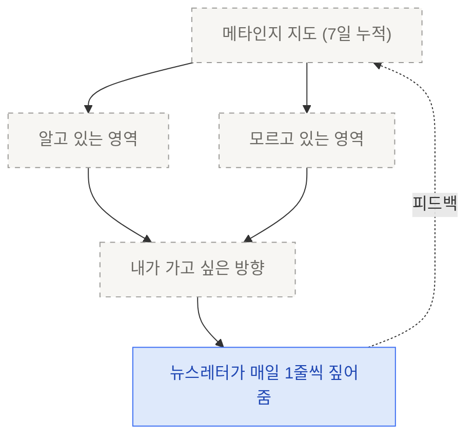

# 5. 뉴스레터 스케줄 + 메타인지 지도

> outbox가 만들어졌으면, 이제 **하루에 한 번 본인에게 도착**시킵니다. 단, 뉴스레터는 요약·정리가 아니라, **10분 만에 시작할 수 있는 첫 문장**을 제안하는 형태로.

<Callout type="warning">
이 페이지는 **본문 채워야 함**. 스케줄 구성 방법과 메타인지 지도 v0 보강 예정. v1은 최소만, 풀스케일은 다음 주 후보로 빼둠.
</Callout>

## 알림 시점과 커맨드 호출 시점은 다릅니다

먼저 두 가지를 분리합니다. 같이 묶이면 "아침에 못 돌리면 그날 학습은 망함" 패턴이 생겨요.

| 무엇 | 언제 | 누가 트리거 |
|---|---|---|
| **`/돌아보기` 호출** (인출·메타인지 1줄 생성) | 본인 리듬에 맞춰. PR 한 편 끝낸 뒤·자기 전·일요일 오후. 시간 제약 X | 본인 또는 cron |
| **뉴스레터 발송** (어제 `outbox/`를 메일·디스코드로) | 매일 아침 7시. 단순 알림 | 스케줄러 |

핵심은 — `/돌아보기`는 *학습 행위*라 본인 리듬에 따라, 뉴스레터는 *알림*이라 아침 7시. 둘이 같은 시간일 필요 없습니다. 어제 자기 전 `/돌아보기`로 만든 outbox 글이 오늘 아침 7시 뉴스레터로 본인에게 도착하는 식.

## v1에 들어가는 것 (최소)

1. **뉴스레터 발송 1회 · 매일 아침 7시** (알림만)
2. **본문 3줄**: 메타인지 1줄 + 다음 한 줄 액션 + 근거 인용
3. **첫 문장 제안**: 그 액션을 시작할 **첫 프롬프트 한 줄**

## v1에서 빼는 것 (다음 주 후보)

- 메타인지 지도 (전체 매핑 시각화)
- 방향 검토 위젯
- 뉴스레터 풀스케일 (요약·정리·분류 추가)

<Callout type="warning">
6번에 5가지를 한 번에 담으면 v1이 v0.3이 됩니다. **앞 3개만** 잡고, 나머지는 다음 주로 빼두세요.
</Callout>

## 스케줄 거는 법

```bash
# TODO: 라이브 직전 정리 — /schedule 사용 예시
```

## 메타인지 지도 (다음 주 미리보기)

7일치 outbox가 쌓이면, "내가 뭘 알고 / 뭘 모르고 있는지"의 윤곽이 떠오릅니다. 이때 중요한 건 — **지도를 다 채우는 게 목적이 아니라**, 내가 어디쯤 있는지 보고 본인이 가고 싶은 방향을 정하는 것.



→ 마무리: [미션 · 5/26 마감](/week2/mission)
