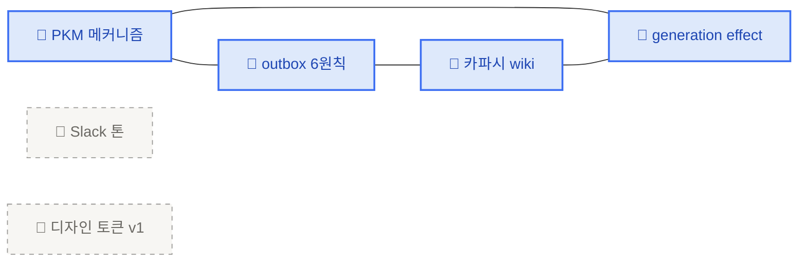
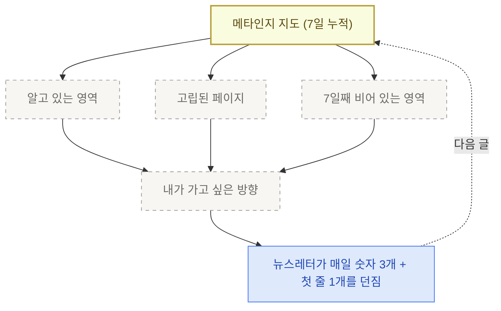

# 5. 뉴스레터 스케줄 + 메타인지 지도

> outbox와 `.ai-wiki/`가 채워졌으면, 이제 매일 아침 그 둘을 함께 읽고 **어제까지의 나를 숫자 3개로 비추고 오늘 시작할 첫 줄 하나를 같이 던지는** 메일이 본인에게 도착합니다. 요약·정리가 아닙니다.

## 알림 시점과 커맨드 호출 시점은 다릅니다

먼저 두 가지를 분리합니다. 같이 묶이면 "아침에 못 돌리면 그날 학습은 망함" 패턴이 생겨요.

| 무엇 | 언제 | 누가 트리거 |
|---|---|---|
| **`/돌아보기` 호출** (인출·메타인지 1줄 생성) | 본인 리듬에 맞춰. PR 한 편 끝낸 뒤·자기 전·일요일 오후. 시간 제약 X | 본인 |
| **뉴스레터 발송** (어제까지의 outbox·.ai-wiki를 본인에게) | 매일 아침 7시 (KST). 단순 알림 | `/schedule` |

핵심은 — `/돌아보기`는 *학습 행위*라 본인 리듬에 따라, 뉴스레터는 *알림*이라 아침 7시. 어제 자기 전 `/돌아보기`로 만든 outbox 글이 오늘 아침 7시 뉴스레터로 본인에게 도착하는 식.

## 매일 아침 도착하는 3 블록

뉴스레터 본문은 정해진 3 블록입니다. 더 길지도 짧지도 않게.

<CardGrid columns={3}>
  <Card title="① 어제까지의 나" icon="📊">
    누적·신규·고립을 숫자 3개로
  </Card>
  <Card title="② 메타인지 지도" icon="🗺️">
    `.ai-wiki/` 페이지 그래프 + 비어 있는 영역
  </Card>
  <Card title="③ 오늘 첫 줄" icon="✍️">
    1줄 의도 + 복붙할 첫 프롬프트
  </Card>
</CardGrid>

세 블록은 같은 정보를 다른 각도로 보여줍니다. ①은 *얼마*, ②는 *어디가 비어 있나*, ③은 *그래서 오늘 뭘 시작하나*.

## ① 어제까지의 나 — 숫자 3개

세 가지만 셉니다. 더 늘리면 메타인지 지도가 대시보드가 됩니다.

| 숫자 | 어디서 세나 | 왜 이걸 |
|---|---|---|
| **누적 outbox** | `outbox/*.md` 파일 수 | 7일치 누적이 보여야 메타인지가 시작됨 |
| **신규 outbox (어제 +N)** | git log `--since=24h` 중 `outbox/` 경로 | 어제 행동이 그대로 숫자가 됨 |
| **고립 페이지** | `.ai-wiki/` 내 인링크 0 페이지 수 | 알고는 있는데 연결이 안 된 자리 — 메타인지 1순위 |

영역 분포는 `.ai-wiki/` 페이지의 frontmatter 카테고리 또는 파일명 prefix로 끊습니다. 도착하는 메일에는 한눈에 보이도록 가로 막대로 옵니다.

```text
📊 영역 분포 (지난 7일, .ai-wiki/ 기준)

PKM 메커니즘      ████████ 4편
운영 DNA          ████ 2편
디자인 토큰       ██ 1편
프롬프트 라이팅   (7일째 비어 있음)
```

같은 영역에 4편이 쌓이는 동안 다른 영역이 7일째 0이라면, 그건 본인이 의식하지 못한 편향. 메타인지의 시작점입니다.

## ② 메타인지 지도 — 고립 페이지

7일치 `.ai-wiki/` 페이지를 그래프로 그리면 — 서로 인용·참조로 연결된 페이지와, 한 번도 다른 페이지에 안 묶인 **고립 페이지**가 갈립니다.



블루는 다른 페이지에서 인용된 적이 있는 페이지(=내 안에서 연결됨), 회색 점선은 7일째 인링크가 0인 페이지(=고립).

> **고립을 채우는 게 아니라, 고립을 본 다음 본인이 가고 싶은 방향을 정합니다.**
> 인용이 0이라는 건 그 자체로 신호 — 흥미가 안 갔거나, 더 풀 게 없거나, 다음 주에 다시 보고 싶거나.

## ③ 오늘 첫 줄 — 1줄 의도 + 복붙 프롬프트

마지막 블록은 본인이 한 줄을 쓰기 위한 첫 손잡이입니다. 예시 — 어제 메일이 이렇게 도착했다고 가정.

<Callout type="tip">
🎯 **오늘 첫 줄: "프롬프트 라이팅 영역이 7일째 0이다. 1단락으로 '내가 자주 깨지는 패턴' 한 가지를 짚어 보세요."**

복붙 가능한 첫 프롬프트:

```text
/쓰기 프롬프트 라이팅에서 내가 자주 깨지는 패턴 1가지.
첫 줄 = 주장. 한 단락 안에 풀기.
```
</Callout>

뉴스레터는 여기서 끊습니다. 본인이 그 한 줄을 쓰는 자리는 메일이 아니라 `outbox/`.

## 스케줄 거는 법 — `/schedule`

remote agent를 매일 아침 7시에 한 번 띄워서, 본인 학습 저장소를 clone하고 위 3 블록을 만들어 Gmail로 보냅니다.

### v1 셋업 (5분)

1. **본인 학습 저장소를 private**으로 두고 `outbox/`·`.ai-wiki/`를 commit해서 push
2. claude.ai에서 Gmail connector 켜기 ([https://claude.ai/customize/connectors](https://claude.ai/customize/connectors))
3. `/schedule` 호출 → 아래 표 그대로 답하기

| 항목 | 값 |
|---|---|
| 액션 | `create` |
| 이름 | `매일 아침 메타인지 뉴스레터` |
| 스케줄 | 한국 시간 매일 07:00 = `0 22 * * *` (UTC) |
| Repo | `https://github.com/<본인>/my-brain-v1` |
| 모델 | `claude-sonnet-4-6` |
| Connector | Gmail |

<Callout type="warning">
remote agent는 Anthropic 클라우드에서 도는 별도 세션입니다. 본인 컴퓨터의 `~/git/my-brain-v1/`은 보이지 않아요. 그래서 — **본인 학습 저장소는 private GitHub repo로 두고 거기서 clone**하는 게 v1의 가장 단순한 경로. 라이브 도큐 저장소(`my-learning-agent`)와 본인 학습 데이터 저장소(`my-brain-v1`)는 분리해서, 도큐는 public, 학습 데이터는 private으로.
</Callout>

### 프롬프트 템플릿

remote agent는 *컨텍스트 0*에서 시작합니다. 프롬프트가 셀프 컨테인드여야 해요. 아래를 그대로 붙입니다.

```text
## 역할
이 저장소는 사용자의 학습 에이전트다. 너의 일은 매일 아침 7시(KST)에
어제까지의 outbox/와 .ai-wiki/를 읽고, 3 블록 뉴스레터를 Gmail로 보내는 것.

## 입력
- outbox/*.md       — 사람이 직접 쓴 글 (raw)
- .ai-wiki/*.md     — /돌아보기가 정리한 LLM용 사본
- git log --since="24 hours ago" -- outbox/

## 출력 (Gmail 본문, 한국어, plain markdown)

### ① 어제까지의 나 — 숫자 3개
- 누적 outbox: N편
- 신규 outbox (어제 24시간): +N편
- 고립 페이지 (.ai-wiki 인링크 0): N편

이어서 가로 막대로 영역 분포 1개 (최대 4영역).
영역은 .ai-wiki 페이지의 frontmatter category 또는
파일명 prefix(YYYY-MM-DD-<영역>-주제.md)에서 추출.

### ② 메타인지 지도 — 고립 페이지
.ai-wiki/ 페이지 중 다른 페이지에서 한 번도 참조되지 않은
파일명 목록 (최대 5개). 옆에 한 줄로 "이 페이지가 왜 고립됐을지" 가설.

### ③ 오늘 첫 줄
1줄 의도(어떤 영역의 무엇을 1단락으로 쓰면 좋을지) +
복붙 가능한 `/쓰기 ...` 프롬프트 1개.

## 톤
요약·정리·해석 X. 본인이 행동 1개를 시작하게 만드는 것만 O.
"손에 남는다 / 거울 / 여정 / ~한 자리" 같은 추상 비유 금지. 단호한 단문.

## 작성 후
- Gmail로 본인(<본인 이메일>)에게 발송
- 제목: 메타인지 뉴스레터 · YYYY-MM-DD
```

### 시간 변환 (한국 → UTC)

- 한국 07:00 = UTC 22:00 (전날)
- cron: `0 22 * * *`
- 매일 한국 시간 아침 7시에 본인 받은편지함에 도착

검증은 1주일 돌려보고 — 메일이 *읽고 싶은가*가 기준. 안 읽고 넘기게 된다면 ①·②의 숫자/시각화가 본인에게 안 맞는 신호.

## 함께 누적되는 형태

지도는 한 번에 그려지지 않습니다. 매일 아침 도착하는 숫자 3개와 1줄 의도가 7일·30일 단위로 쌓이면서, 본인이 어디에 자주 돌아오고 어디는 한 번 보고 안 돌아왔는지가 드러납니다.



→ 마무리: [미션 · 5/26 마감](/week2/mission)
