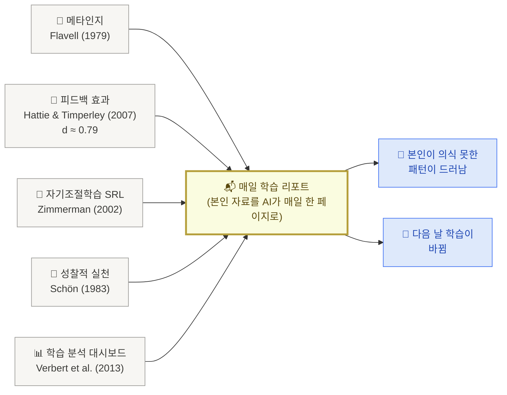

# 1. 왜 매일 학습 리포트인가

> 매일 본인 학습이 어떻게 굴러갔는지를 한 페이지로 비춰보는 루틴. 학술적으로는 50년 누적된 다섯 갈래 — **메타인지 · 피드백 효과 · 자기조절학습 · 성찰적 실천 · 학습 분석 대시보드** — 가 같은 자리에 모입니다.

## 짧은 답

**John Hattie의 메타분석에서 피드백의 효과 크기는 d ≈ 0.79** — 800+ 학습 개입 중 상위권. 그것도 **과제 자체**가 아니라 **학습 과정과 자기조절에 대한 피드백**이 가장 효과적이라는 결론. 매일 도착하는 학습 리포트가 정확히 그 자리.

## 다섯 학술 anchor

각 갈래가 어떻게 매일 리포트와 만나는지 한 단락씩 풀어보면 —

**첫째, 메타인지.** John Flavell이 1979년 **American Psychologist**에 발표한 논문이 "메타인지"라는 용어를 처음 정의했습니다. 본인의 인지 과정을 **관찰하고 조정하는** 능력이 학습 성과를 좌우한다는 발견. 매일 리포트는 본인이 직접 메타인지하기 어려운 부분 — 어제 어떤 패턴이 반복됐는지, 어떤 영역이 비어 있는지 — 을 외부에서 짚어주는 도구입니다.

**둘째, 피드백 효과.** Hattie와 Timperley가 2007년 **Review of Educational Research**에 발표한 **The Power of Feedback** 논문은 피드백의 효과 크기 **d ≈ 0.79**를 보고했습니다. 모든 학습 개입 중 상위권. 그리고 핵심은 — 모든 피드백이 같지 않다는 것. **과제**에 대한 피드백보다 **학습 과정과 자기조절**에 대한 피드백이 가장 효과적입니다. AI 일일 리포트는 정확히 후자의 자리.

**셋째, 자기조절학습 (SRL).** Barry Zimmerman의 자기조절학습 모델은 학습을 **계획 → 수행 → 자기성찰**의 사이클로 본다는 것이 핵심입니다. 자기성찰 단계의 **자기 평가**와 **자기 반응**이 다음 사이클의 계획을 바꾼다는 것. 매일 리포트가 그 자기성찰 단계의 외부 자동화입니다 — 본인이 의지로 시간 내야 했던 reflection을 매일 아침 한 페이지로 받음.

**넷째, 성찰적 실천.** Donald Schön의 **The Reflective Practitioner** (1983)는 **reflection-on-action** 개념을 제시했습니다. 행동 후 짧고 의식적인 되돌아봄이 **학습의 수렴**을 만든다는 것. 직장인의 학습이 가장 자주 막히는 자리가 **돌아볼 시간이 없다**는 것인데, 매일 도착하는 리포트가 그 reflection을 일상 루틴에 박는 외부 트리거가 됩니다.

**다섯째, 학습 분석 대시보드.** Verbert와 동료들이 2013년 **American Behavioral Scientist**에 발표한 리뷰는 학습 분석 대시보드(LAD)가 학습자의 **인지·메타인지·정서**에 어떻게 영향을 주는지 다룹니다. 결론은 명확합니다 — LAD는 데이터를 **보여주는 것**이 아니라 **자기 모니터링과 reflection을 트리거**하는 자리. AI 일일 리포트는 본인을 위한 LAD.

<Callout type="info">
**한 줄 본질** — 매일 도착하는 학습 리포트는 **피드백 + 메타인지 + 자기조절학습 + 성찰** 네 가지를 한 자리에서 발현하는 도구. 학술적으로 가장 효과 큰 개입 묶음을 일상에 박는 것이 핵심입니다.
</Callout>

## 출처 (전부 학술 원전)

- Flavell, J. H. (1979). Metacognition and cognitive monitoring: A new area of cognitive-developmental inquiry. **American Psychologist**, 34(10), 906–911.
- Hattie, J., & Timperley, H. (2007). The power of feedback. **Review of Educational Research**, 77(1), 81–112.
- Zimmerman, B. J. (2002). Becoming a self-regulated learner: An overview. **Theory Into Practice**, 41(2), 64–70.
- Schön, D. A. (1983). **The Reflective Practitioner: How Professionals Think in Action**. Basic Books.
- Hattie, J. (2009). **Visible Learning: A Synthesis of Over 800 Meta-Analyses Relating to Achievement**. Routledge.
- Verbert, K., Duval, E., Klerkx, J., Govaerts, S., & Santos, J. L. (2013). Learning analytics dashboard applications. **American Behavioral Scientist**, 57(10), 1500–1509.

→ 다음: [2. 리포트 v1 셋업](/week5/setup)
